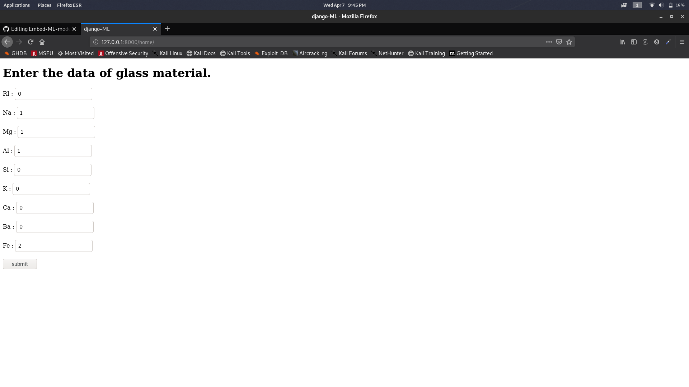
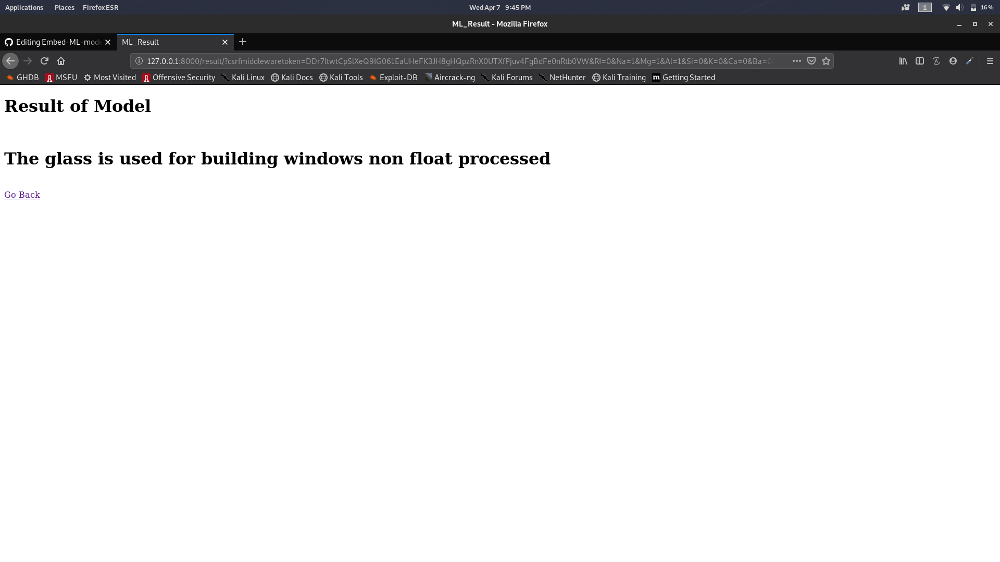

# Embed-ML-model-to-Web

<h2>This is a simple web based ML mode</h2>

Aim of the model is to get the weightage of the elements as input for the type glass and predict the type of glass usage

  

The Model folder contains the ML program in python which is converted to .sav using joblib python module.

That .sav file is used in django to integrate with the website

  

The djangoMl folder contains the django files which using put it in your django virtual environment and add the path (urls.py)to this folder

The ml folder contains the template of the website in html format (home.html for input) and (result.html for output)

Adjust the setting.py file in django so that you can integrate the template with the django view.py 

Similar way you can add your model and adjust the webiste too.

<h2>Screenshot</h2>
<h3>Input page</h3>

<h3>Result page </h3>

